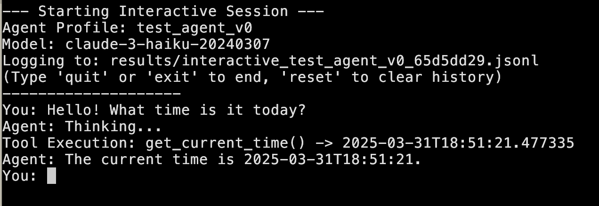

# AwaQ Agents

Minimal framework for tool-calling LLM agents using the claudette library from Answer.ai.

Setup your .env file with the `ANTHROPIC_API_KEY` variable.

## Talking to an agent.

```bash
python run_interactive.py
```

By default this runs the test agent here: `profiles/agents/example_agent/`.
This basic agent uses the cheapest Haiku model, and has a single tool that finds the current time. 

## Implementation 

The AwaQ agents are built on top of the claudette library, and rely specifically on its 'toolloop'. The models use the tool loop to run a series of given function calls that best complete a user's request. 
By doing this it creates the simplest possible version of an LLM agent: an LLM with branching loops (self-conversations) away from the thread of the user's main request. 

RAG agents are an instance of agents where:
- The models do a single-call of a toolloop (max_steps=1).
- The RAG function 'find_similar' takes three parameters: a query, an external text database, and the number of matches to return. It then returns the external texts most semantically similar to the given query.

More generally, the models can use many different given tools in an arbitrary loop. 

This is the key point where the magic happens: the models can weave the tools and make smart decisions about the best thing to do for the given input. With a well-thought out prompt structure (both system + user) the models can  increase their computing resources by calling the needed tools, the needed amount of times, to complete a complex task. 

Additionally, we also have the ability to set a "prefill" prompt before calling the tool loop. Prefilling is an incredibly powerful way of directly steering a model's output. It basically bootstraps the model's response by *forcing* it to start with the given prefill prompt. Prefill is a fantastic and improvable way to better condition our agent's output.

Their is also an implementation of the Anthropic [think tool](https://www.anthropic.com/engineering/claude-think-tool) that gives the model access to extra thinking space when needed. This feature excels with good prompting on complex tasks.

Your interaction should look something like:


# TODO: 
- Eval framework.  
- Visualizations. 