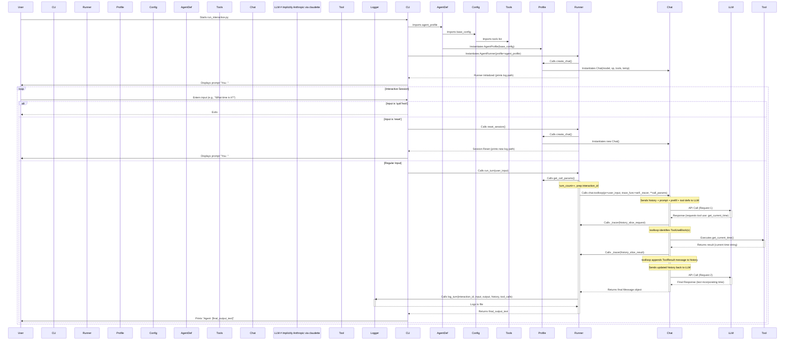

Okay, let's first visualize the current state of the `awaq-agents` framework based on the provided files.

## Mermaid Diagram: `awaq-agents` Current Structure



---

## Revised Plan: PDF RAG System for `awaq-agents`

**(Integrating Agent Report Learnings & `awaq-agents` Structure)**

### Overview: Architecture Philosophy

This plan outlines a robust, multi-modal PDF RAG system built using the `awaq-agents` framework. Grounded in the principles from the LLM Agents report and Anthropic's guidance, we prioritize an **incremental build**, starting with a **structured ingestion workflow** and a **capable single query agent**. This approach emphasizes simplicity, modularity, observability (leveraging `AgentRunner`'s logging), and controlled complexity, aligning with the structure of `awaq-agents` (`AgentProfile`, `AgentRunner`, `tools`). Multi-agent architectures will only be considered in later phases if the single-agent approach proves insufficient for complex reasoning tasks.

**Stages:**

1.  **Ingestion Stage (Offline Workflow):** Prepares PDF data into queryable formats (vector store, graph). Executed separately, *not* using `AgentRunner`.
2.  **Query Stage (Online Agent):** Uses an `AgentRunner` with a dedicated `AgentProfile` to interactively answer user questions based on the ingested data.

---

## Stage 1: PDF Ingestion (Structured Workflow - Offline Script)

This stage is implemented as a standalone Python script/pipeline, *outside* the interactive `AgentRunner` loop. It focuses on reliably transforming PDF content.

**Workflow Steps (Executed by the Script):**

1.  **PDF Parsing & Chunking:**
    *   Input: PDF file path.
    *   Process: Use libraries (`PyMuPDF`, `layoutparser`, potentially `unstructured.io`) to extract text, tables, and image elements, preserving layout context where possible. Convert complex layouts to Markdown or structured JSON. Segment into logical chunks (paragraphs, table cells, image descriptions) with metadata (page number, section hierarchy, bounding boxes).
    *   Output: List/Stream of structured `Chunk` objects.

2.  **Embedding Generation:**
    *   Input: `Chunk` objects.
    *   Process:
        *   For text chunks: Generate embeddings using a model like `text-embedding-3-large` via its API.
        *   For visual chunks (images/tables): Optionally generate embeddings using multi-modal models (e.g., CLIP, future Anthropic models) or use OCR/table transformers.
        *   Store embeddings in a Vector Database (e.g., ChromaDB, LanceDB) indexed by a unique `chunk_id`.
    *   Output: Populated vector store.

3.  **Knowledge Graph Construction:**
    *   Input: `Chunk` objects with their IDs.
    *   Process: Analyze document structure (headings from parsing, layout proximity) to build a graph (`NetworkX` initially).
        *   Nodes: Represent chunks, sections, or potentially extracted entities. Store metadata including `chunk_id` (link to vector store), summary (can use an LLM call *within this script* if needed), page number.
        *   Edges: Represent relationships like `contains` (section->paragraph), `follows` (paragraph->paragraph), `references_table`, `mentions_entity`.
    *   Output: Saved graph file (e.g., GML, GraphML) or populated graph database (e.g., Neo4j).

**Key Point:** This workflow is deterministic and repeatable, making a scripted approach more suitable than a dynamic agent loop.

---

## Stage 2: Intelligent RAG System (Query Agent - Online via `AgentRunner`)

This stage uses the `awaq-agents` framework to answer user queries based on the data prepared in Stage 1.

### Agent Profile Definition (`pdf_rag_agent_v1.py`)

```python
# profiles/agents/pdf_rag_agent/config.py
from .tools import pdf_tools # Assuming tools are defined in profiles/agents/pdf_rag_agent/tools.py

profile_id = "pdf_rag_agent_v1"
# Choose a capable model like Claude 3 Sonnet or Opus for complex reasoning
model = "claude-3-sonnet-20240229"
system_prompt = """You are an expert research assistant specializing in analyzing PDF documents using a combination of semantic search and knowledge graph traversal. You have access to tools that can search text embeddings and query a structural graph derived from the PDF.

Your goal is to answer user questions accurately and comprehensively, **always citing your sources** precisely.

**Your Process:**
1.  **Understand the Query:** Analyze the user's question, identifying key entities, concepts, and the type of information required.
2.  **Plan Tool Use:** Decide the best strategy:
    *   For broad semantic queries or finding specific phrases: Prioritize `search_embeddings`.
    *   For queries about structure, relationships, or navigating sections: Prioritize `search_graph`.
    *   For complex queries: Use a hybrid approach. Often, `search_embeddings` first to find relevant areas, then `search_graph` to explore context around those areas.
3.  **Execute Tools:** Call the necessary tools (`search_embeddings`, `search_graph`, `get_chunk_details`) sequentially or iteratively based on your plan. Use the results from one tool to inform the parameters of the next if needed.
4.  **Synthesize & Cite:** Combine the information retrieved from the tools. Formulate a clear, concise answer. **Crucially, use the `synthesize_answer_with_citations` tool as your final step** to format the response and ensure every piece of information is explicitly linked back to its source (e.g., page number, section name, graph node ID). Do not output facts without calling this tool for citation formatting.
5.  **Self-Correction:** If initial tool results are insufficient or ambiguous, reconsider your plan and try different tool parameters or sequences.
"""
prefill_prompt = "Okay, I understand the query. I will now determine the best tool strategy and retrieve the necessary information to provide a cited answer."

DEFAULT_PARAMS = {
    'temp': 0.1, # Allow slightly more creativity in synthesis but keep factual retrieval strict
    'maxtok': 4096,
    'max_steps': 15, # Allow for potentially complex multi-step tool use
}

pdf_rag_config = {
    "profile_id": profile_id,
    "model": model,
    "system_prompt": system_prompt,
    "prefill_prompt": prefill_prompt,
    "tools": pdf_tools, # List of @tool decorated functions
    "default_params": DEFAULT_PARAMS
}

# profiles/agents/pdf_rag_agent/agent.py
from profiles.base_profile import AgentProfile
from .config import pdf_rag_config

profile = AgentProfile(**pdf_rag_config)
```

### Tool Definitions (`pdf_rag_agent/tools.py`)

```python
# profiles/agents/pdf_rag_agent/tools.py
from claudette.core import tool
from typing import List, Dict, Any, Tuple, Optional

# Assume these functions interact with Stage 1 outputs (VectorDB, Graph file/DB)
# Placeholder implementations - Replace with actual logic

@tool
def search_embeddings(query_text: str, top_k: int = 5) -> List[Dict[str, Any]]:
    """
    Performs semantic search on the document's text chunks based on the query text.
    Returns a list of the top_k most relevant chunks, including their IDs, text snippets, and relevance scores.
    """
    print(f"Tool Call: search_embeddings(query='{query_text[:50]}...', top_k={top_k})")
    # ... actual vector DB query logic ...
    # Example Return: [{'chunk_id': 'c123', 'text_snippet': '...', 'score': 0.85}, ...]
    pass # Replace with implementation

@tool
def search_graph(start_node_id: Optional[str] = None, relationship_types: Optional[List[str]] = None, keywords: Optional[List[str]] = None, depth: int = 2) -> List[Dict[str, Any]]:
    """
    Searches the document's knowledge graph. Can start from a specific node (e.g., found via embedding search)
    or search globally based on keywords. Traverses specified relationships up to a certain depth.
    Returns a list of relevant nodes or paths found, including node IDs, labels, metadata, and relationships.
    """
    print(f"Tool Call: search_graph(start={start_node_id}, rels={relationship_types}, keywords={keywords}, depth={depth})")
    # ... actual graph query logic (NetworkX or Neo4j Cypher) ...
    # Example Return: [{'node_id': 'n456', 'label': 'Section', 'metadata': {'title': '...', 'page': 5}}, ...]
    pass # Replace with implementation

@tool
def get_chunk_details(chunk_ids: List[str]) -> Dict[str, Dict[str, Any]]:
    """
    Retrieves the full text and metadata (page number, section, etc.) for a given list of chunk IDs.
    Useful for getting complete context after finding relevant IDs via search.
    """
    print(f"Tool Call: get_chunk_details(ids={chunk_ids})")
    # ... logic to retrieve chunk details from storage (e.g., lookup in JSON, DB) ...
    # Example Return: {'c123': {'text': 'Full text...', 'page': 5, 'section': 'Introduction'}, ...}
    pass # Replace with implementation

@tool
def synthesize_answer_with_citations(query: str, findings: List[Dict[str, Any]]) -> str:
    """
    Constructs the final answer to the user's query based on the gathered findings.
    Each finding dictionary should contain the information snippet and source details (e.g., chunk_id, node_id, page, text_snippet).
    This tool formats the answer and embeds citations directly, e.g., "Revenue increased by 10% [Source: Page 12, Section 3.1, Chunk c456]".
    **MUST be called as the final step before presenting the answer to the user.**
    """
    print(f"Tool Call: synthesize_answer_with_citations(query='{query[:50]}...', findings_count={len(findings)})")
    # ... logic to format the answer string with embedded citations based on findings ...
    # Example:
    # response = f"Based on the document:\n"
    # for finding in findings:
    #    response += f"- {finding['info']} [Source: Page {finding.get('page', 'N/A')}, ID {finding.get('chunk_id') or finding.get('node_id', 'N/A')}]\n"
    # return response
    pass # Replace with implementation

pdf_tools = [search_embeddings, search_graph, get_chunk_details, synthesize_answer_with_citations]

```

### Execution via `AgentRunner`

1.  The `run_interactive.py` script (or a similar entry point) would import the `pdf_rag_agent` profile.
2.  It instantiates `AgentRunner` with this profile.
3.  When a user asks a question (`run_turn` is called):
    *   `AgentRunner` invokes `chat.toolloop`.
    *   Guided by the `system_prompt`, the LLM reasons about the query and plans tool use.
    *   `toolloop` detects LLM requests for `search_embeddings`, `search_graph`, etc.
    *   `toolloop` executes the corresponding Python tool functions, which interact with the Vector DB and Graph data created in Stage 1.
    *   The `_tracer` function within `AgentRunner` captures these tool calls/results.
    *   The LLM receives tool results and continues reasoning, potentially calling more tools.
    *   Finally, the LLM calls `synthesize_answer_with_citations` with the gathered evidence.
    *   `toolloop` executes this, returning the formatted, cited answer.
    *   `AgentRunner` logs the entire turn (history, tool calls via tracer, final output) and returns the answer to the user.

---

## Implementation Roadmap (Phased for `awaq-agents`)

### Phase 1: Foundational Workflow & Basic RAG Agent
*   **Goal:** End-to-end PDF ingestion and basic semantic search retrieval.
*   **Tasks:**
    *   Implement the **Stage 1 Ingestion Workflow script** (parse PDF -> chunks -> embeddings -> basic graph -> save outputs).
    *   Define the `pdf_rag_agent` profile (`config.py`, `agent.py`) with the initial `system_prompt`.
    *   Implement the core `search_embeddings` and `get_chunk_details` tools (`tools.py`).
    *   Implement a basic `synthesize_answer_with_citations` tool (simple formatting).
    *   Test using `AgentRunner` and `run_interactive.py`: Can it retrieve relevant chunks based on semantic similarity and cite them minimally?
    *   Utilize `AgentRunner` logging heavily for debugging.

### Phase 2: Integrating Graph Search & Enhancing Synthesis
*   **Goal:** Add graph context and improve answer quality/citation robustness.
*   **Tasks:**
    *   Enhance the Stage 1 graph creation logic (more detailed nodes/edges).
    *   Implement the `search_graph` tool.
    *   Refine the `pdf_rag_agent` `system_prompt` to guide hybrid search strategies (embedding + graph).
    *   Significantly improve the `synthesize_answer_with_citations` tool to handle complex findings and generate rich, accurate citations based on both graph and chunk data.
    *   Add **self-correction prompts/examples** to the system prompt to handle cases where initial searches fail.
    *   Benchmark query performance (relevance, citation accuracy).

### Phase 3: Advanced Features & Multi-Agent Exploration (Conditional)
*   **Goal:** Handle complex queries, multi-modal data, evaluate advanced architectures.
*   **Tasks:**
    *   Integrate multi-modal embedding search and retrieval (if applicable).
    *   Improve handling of complex tables/diagrams (potentially specialized tools or parsing).
    *   **Evaluate Single Agent:** Rigorously test the Phase 2 agent against complex queries. Identify specific failure modes (e.g., conflicting information synthesis, poor strategic planning).
    *   **If Justified by Evaluation:**
        *   *Design* potential specialized agent profiles (e.g., `GraphStrategistAgent`, `EmbeddingExpertAgent`).
        *   *Design* an orchestrator logic (either a new `OrchestratorAgent` profile managing others via tools, or adapting `AgentRunner` if the framework allows).
        *   *Prototype* this multi-agent setup using the `awaq-agents` structure (multiple `AgentProfile` instances, tool calls between them).
        *   *Compare* performance, latency, cost, and complexity against the enhanced single agent from Phase 2. Only adopt if a clear benefit is demonstrated.

---

## Anchoring & Explainability (Leveraging `awaq-agents`)

*   **Core Responsibility:** The `synthesize_answer_with_citations` tool is the primary enforcer of anchoring.
*   **Observability:** `AgentRunner`'s built-in logging (`log_turn`) and the `_tracer` provide a detailed trace of the LLM's reasoning (via history) and actions (via tool calls), crucial for debugging and understanding *how* an answer was derived.

---

## Conclusion

This revised plan integrates the PDF RAG system design with the specific structures and capabilities of the `awaq-agents` framework. By starting with a robust offline ingestion workflow and a well-prompted single query agent managed by `AgentRunner`, we follow best practices for building reliable LLM applications incrementally. The plan leverages `AgentProfile` for configuration, `@tool` for capabilities, and `AgentRunner`/`toolloop` for orchestrating the query process, while keeping options open for carefully considered multi-agent enhancements in later stages.