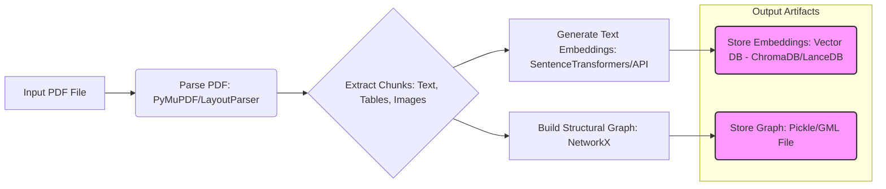
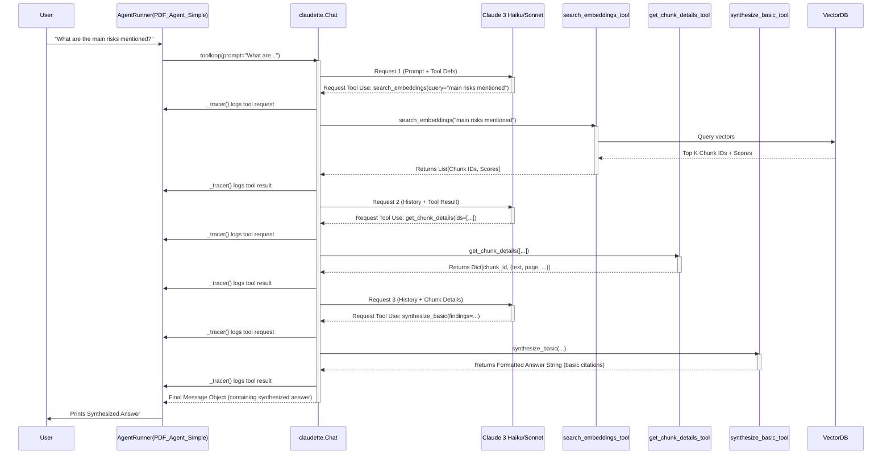
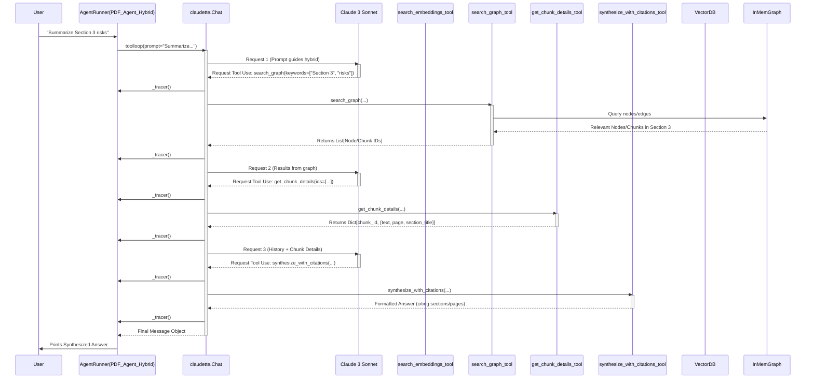
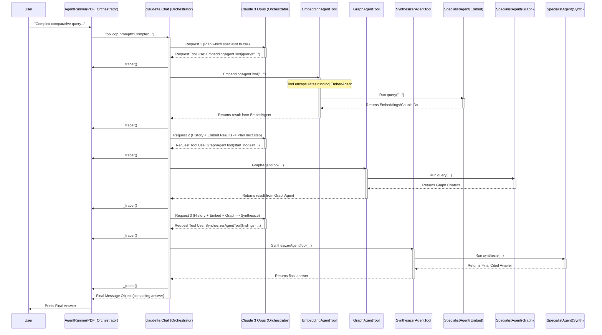

Alright, we're building a system to intelligently query PDF documents. The goal isn't just keyword search; we want to understand the *meaning* and the *structure* of the document to answer complex questions accurately, telling the user *exactly* where the information came from.

We've got this `awaq-agents` framework which uses `claudette` under the hood, specifically the `toolloop` for handling interactions where the AI needs to use external functions (our tools). That's a good starting point because it forces the AI to explicitly request actions, which gives us observability – a key principle we learned from the agent report.

Our guiding philosophy here, heavily influenced by Anthropic's practical advice and the broader lessons learned by the agent community, is:

1.  **Start Simple, Build Incrementally:** We'll begin with the most basic useful thing and layer complexity deliberately. No massive multi-agent systems upfront.
2.  **Workflow First:** For predictable tasks like processing the PDF, we'll use a straightforward script (a workflow), not a complex agent. Agents are for the dynamic, less predictable query part.
3.  **Observability is Key:** We need to see what the agent is *thinking* (planning) and *doing* (tool calls). `AgentRunner`'s logging and tracer are crucial.
4.  **Grounding & Citations:** Every piece of information the agent provides *must* be traceable back to the source PDF. No unverified claims.

We'll combine two main techniques:
*   **Semantic Search (Embeddings):** Great for finding text based on meaning, even if keywords don't match exactly. Good for recall.
*   **Knowledge Graph:** Represents the document's structure (sections, headings, relationships). Good for context, precision, and explaining *how* information connects.

Let's break down the build into concrete phases.

---

### Phase 0: Getting Our Data Ready (The Ingestion Workflow)

**Goal:** Convert a PDF into queryable data structures (embeddings and a graph). This is **not** an agent task; it's a one-off (or periodic) data preparation script.

**Why a Workflow?** Parsing PDFs and building data structures is complex but deterministic. We want reliability and predictability here, not an LLM potentially hallucinating the process. It's cheaper and more robust to script it.

**Architecture (Offline Script):**

**Steps:**

1.  **Parsing:** Use `PyMuPDF` or similar to get text, layout info (bounding boxes), and maybe images. `layoutparser` can help identify semantic regions (paragraphs, titles, lists, tables).
2.  **Chunking:** Break the extracted content into meaningful `Chunk` objects (maybe a dataclass `Chunk(id: str, text: str, type: str, page: int, bbox: tuple, section_id: Optional[str])`). Smart chunking is important – not too big, not too small.
3.  **Embedding:** For each text `Chunk`, generate an embedding vector using something like `SentenceTransformers` (local) or an API (`text-embedding-3-large`).
4.  **Vector Storage:** Store these embeddings and their corresponding `chunk_id`s in a vector database (like ChromaDB or LanceDB for simplicity, running locally). This allows fast semantic similarity searches later.
5.  **Graph Building:** Create a `NetworkX` graph *in memory* during this script.
    *   **Nodes:** Represent sections, subsections, and potentially individual chunks or important tables/figures. Store metadata on nodes: `title`, `page_number`, maybe a list of `chunk_ids` belonging to that section.
    *   **Edges:** Represent relationships like `PARENT_OF` (section -> subsection), `CONTAINS` (section -> chunk), `FOLLOWS` (chunk -> chunk).
6.  **Graph Storage:** Save the populated `NetworkX` graph object to disk using `pickle` or a standard format like GML. This allows our query agent to load it easily later.

**Low-Level Consideration:** We need standardized IDs (`chunk_id`, `node_id`) that link the graph nodes back to the chunks and their embeddings.

**Result:** We have a vector store directory and a graph file ready for querying.

---

### Phase 1: The Simplest Query Agent (Embedding Search Only)

**Goal:** Create the most basic agent that can answer a question using *only* semantic search on the embeddings.

**Architecture (Single Agent, ReAct Loop via `toolloop`):**

**Implementation:**

1.  **Load Data:** Modify `AgentRunner` or the startup script (`run_interactive.py`) to load the Vector DB client when the PDF agent starts.
2.  **Agent Profile (`pdf_agent_v1_simple`):**
    *   `model`: Start with something cheap and fast like `claude-3-haiku-20240307`.
    *   `system_prompt`: Very simple instructions: "You answer questions about a PDF using semantic search. Use `search_embeddings` to find relevant text chunks. Use `get_chunk_details` to get the full text. Use `synthesize_basic` to format the final answer with page numbers."
    *   `tools`: `[search_embeddings, get_chunk_details, synthesize_basic]` (defined below).
    *   `default_params`: Keep `temp=0.0` for deterministic tool use.
3.  **Tools (`pdf_rag_tools_simple.py`):**
    *   `@tool search_embeddings(query_text: str, top_k: int = 5) -> List[Dict]`: Queries the loaded Vector DB, returns `[{'chunk_id': '...', 'score': ...}]`.
    *   `@tool get_chunk_details(chunk_ids: List[str]) -> Dict`: Looks up full text and metadata (page #) for given `chunk_ids` (maybe from a simple JSON lookup file created during ingestion).
    *   `@tool synthesize_basic(query: str, findings: List[Dict]) -> str`: Takes findings (which should include text snippets and page numbers from `get_chunk_details`) and constructs a simple answer string, maybe like: "Based on the document:\n- [Snippet 1] (Page X)\n- [Snippet 2] (Page Y)".
4.  **Test:** Run simple queries. Check the logs (`AgentRunner` output) to see if the correct tools are called and if the basic synthesis works. Debug!

**Result:** A functioning, albeit basic, RAG agent that finds relevant text snippets.

---

### Phase 2: Adding the Graph for Structure and Context

**Goal:** Enhance the agent with knowledge of the document's structure using the graph, allowing it to answer questions about relationships, sections, and refine embedding search results.

**Architecture (Single Agent, Hybrid Strategy):** The core loop remains similar, but the agent's reasoning and available tools expand.

**Implementation:**

1.  **Load Data:** Update the startup process to load the saved `NetworkX` graph object (e.g., from the pickle file) into memory, making it accessible to the tools.
2.  **Agent Profile (`pdf_agent_v2_hybrid`):**
    *   `model`: Consider upgrading to `claude-3-sonnet-20240229` for potentially better planning.
    *   `system_prompt`: Much more sophisticated. Needs to explain *both* embedding and graph search tools, guide the agent on *when* to use which (semantic vs. structural queries), and suggest hybrid strategies (e.g., "Use `search_embeddings` to find relevant passages, then use `search_graph` starting from the nodes related to those passages to understand their context"). Emphasize the importance of the final `synthesize_with_citations` call.
    *   `tools`: `[search_embeddings, search_graph, get_chunk_details, synthesize_with_citations]`
3.  **Tools (`pdf_rag_tools_hybrid.py`):**
    *   Keep `search_embeddings` and `get_chunk_details`.
    *   `@tool search_graph(start_node_id: Optional[str], keywords: Optional[List[str]], ...) -> List[Dict]`: This tool now queries the *in-memory `NetworkX` graph object*. It needs logic to find nodes by keyword (in node metadata), traverse relationships, etc. Returns relevant node info (`{'node_id': ..., 'metadata': {...}}`).
    *   `@tool synthesize_with_citations(query: str, findings: List[Dict]) -> str`: This needs a significant upgrade. It must accept findings from *both* embedding and graph searches, potentially reconcile them, and generate citations that clearly reference the source type (e.g., "Section 3.1 discusses X [Source: Graph Node 'sec3.1', Page 10]" or "The document states Y [Source: Text Chunk 'c123', Page 15]").
4.  **Test:** Use queries that require structural understanding ("What are the headings in Section 4?", "Compare the points made in the introduction and conclusion sections", "Find the paragraph following the main diagram on page 5"). Check logs to verify graph traversal and combined synthesis.

**Low-Level Consideration:** The `search_graph` tool needs careful implementation to perform meaningful traversals on the `NetworkX` object without being too slow or complex. The `synthesize_with_citations` tool needs a robust way to represent the source of each piece of information (chunk ID? node ID? page? section title?).

**Result:** A much more capable agent that understands document structure and provides better-contextualized, well-cited answers.

---

### Phase 3: Refinement, Robustness, and Self-Correction

**Goal:** Make the Phase 2 agent more reliable, handle ambiguity better, and potentially correct its own mistakes within a turn.

**Architecture:** Same as Phase 2, but the agent's internal reasoning (prompting) and tool implementations become smarter.

**Implementation:**

1.  **Prompt Engineering (Reflexion Lite):** Enhance the `system_prompt` further. Add instructions inspired by Reflexion: "After retrieving information using tools, critically evaluate if it fully answers the query. If the results seem incomplete or contradictory, consider reformulating your search or using a different tool strategy before synthesizing the final answer."
2.  **Tool Enhancements:**
    *   Make `search_embeddings` and `search_graph` return confidence scores or clearer indicators if results are weak.
    *   Improve error handling within tools (e.g., what if a `chunk_id` isn't found?).
    *   Refine `synthesize_with_citations` to handle conflicting information gracefully (e.g., "Source A says X [Page 5], while Source B implies Y [Page 12]").
3.  **Feedback Loop (Manual):** Test with tricky queries. Analyze the logs (`AgentRunner` output). If the agent fails, try to understand why (poor tool choice? bad synthesis? misinterpretation?). Use these failures to refine the system prompt or tool logic.
4.  **Evaluation Set:** Create a small set of representative question-answer pairs (with expected source citations) to run regularly. This helps catch regressions when we change prompts or tools.
5.  **Persistence Option:** Consider if loading the graph from disk on each query (instead of keeping it in memory) is necessary for stability, especially if the ingestion workflow runs frequently. Trade-off: load time vs. memory usage/staleness. For now, in-memory loaded at startup is fine.

**Result:** A more polished, trustworthy agent that's less likely to give nonsensical or poorly cited answers.

---

### Phase 4 (Conditional): Exploring Multi-Agent Architectures

**Goal:** *Only if* the single hybrid agent consistently fails on highly complex queries requiring distinct specialized reasoning (e.g., deep recursive graph analysis vs. broad multi-document comparison), explore a multi-agent setup.

**Why?** Maybe a single prompt becomes too complex to reliably guide both deep graph logic and broad semantic search AND synthesis. Splitting roles *might* simplify each agent's task. But this adds significant complexity.

**Potential Architecture (Hierarchical Orchestrator):**

**Implementation Sketch:**

1.  **Define Specialist Profiles:** Create separate `AgentProfile`s for `EmbeddingExpert`, `GraphStrategist`, `Synthesizer`. Each has a tightly focused system prompt and only the tools relevant to its task.
2.  **Define Orchestrator Profile:** An `OrchestratorAgent` profile (likely needing `claude-3-opus-20240228` for complex coordination). Its system prompt explains the goal and the available *specialist agent tools*.
3.  **Implement Agent Tools:** Create tools for the Orchestrator (e.g., `call_embedding_agent(query) -> findings`, `call_graph_agent(...) -> graph_context`). These tools would instantiate and run a *separate* `AgentRunner` for the specialist agent (or directly use its `Chat` object) to get the result. This is complex! How state/history is managed between them is a major challenge.
4.  **Compare:** Rigorously compare this multi-agent setup's performance, cost, latency, and debuggability against the best single agent from Phase 3.

**Caveat:** This adds *significant* complexity (multiple chat states, inter-agent communication via tool calls, potential for cascading errors). Only proceed if the single agent truly hits a hard limit and the benefits demonstrably outweigh the costs.

---

**Final Thoughts:**

This plan gives us a clear, practical path using `awaq-agents`. We start with data prep, build the simplest RAG agent, layer in graph structure, refine it, and only then *consider* the complexity of multiple agents. Throughout, we leverage `AgentRunner` for execution and logging, focusing on concrete tools and prompts. Remember to test and iterate at each phase!